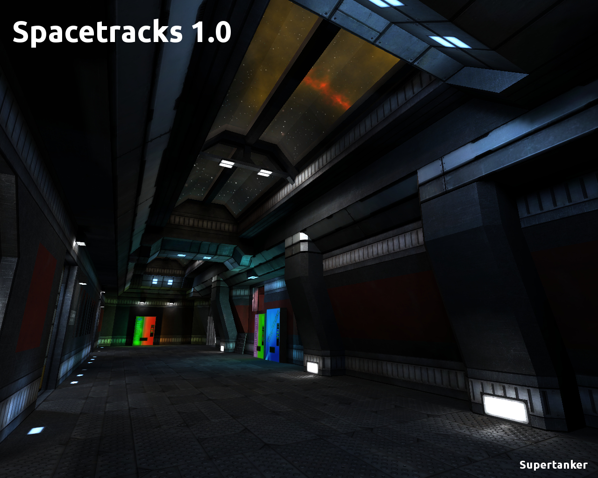

Spacetracks
===========

About
-----

This map features an Intergalactic railyard.

This map is a work in progress by Cody “Supertanker” Jackson for the [Unvanquished](https://unvanquished.net) game project. 

Visit the [Unvanquished website](https://unvanquished.net/) for more information about the game itself.

Legal
-----

Unless otherwise noted, the content of this package is available under the conditions of the [Creative Commons Attribution-Share Alike 3.0 License](https://creativecommons.org/licenses/by-sa/3.0/).

Some assets may use other licenses, consult [`about/map-station15.txt`](about/map-station15.txt) for more information about authors and licenses.

Current Q3map2 compilation settings are as follows:

FAST (testing):
        bsp: -leaktest 	-meta -samplesize 16
        visoptions: 	-hint -vis -saveprt
        lightoptions: 	-light -lightmapsearchpower 3 -fast -bounce 4 
			-bouncescale 2 -shade -samples 2 -patchshadows 
			-lightmapsize 1024 -deluxe

FINAL (beauty shots):
        bsp: -leaktest  -meta -samplesize 4
        visoptions:     -hint -vis -saveprt
        lightoptions:   -light -lightmapsearchpower 3 -fast -bounce 16 
                        -bouncescale 2 -shade -samples 3 -patchshadows 
                        -lightmapsize 1024 -deluxe -bouncegrid

The map is licensed under a Creative Commons license,
https://creativecommons.org/licenses/by-sa/3.0/
